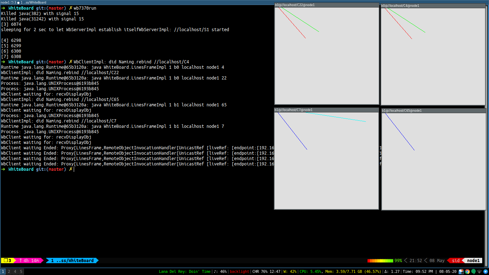

# DIC: P1

**Siddharth Yadav | 2016268**

## New functions

In this section, I've written the new functions that have been added to major files. This functions are present with documentation and their skeleton code(without error handling, try/catch and other unnecessary lines)

### New functions in ServerImpl

```java
/**
     * This functions simply returns all the info about the current server in the form of a list of Aboard structure
     *
     * @return A list of WhiteBoards present in the current server instance
     * @throws java.rmi.RemoteException
     */
    public Vector<ABoard> query() throws java.rmi.RemoteException {
        return this.vBoards;
    }

    /**
     * This function is responsible for transferring WhiteBoard, :boardName, on this server
     * to an new Server, :toServerURL.
     * <p>
     * First, it transfers all the information about :boardName to :toServerURL.
     * Then, it asks each client of :boardName to reconnect to the :toServerURL.
     *
     * @param toServerURL the RMI URL of the server to which we need to transfer the WhiteBoard
     * @param boardName   The name of the WhiteBoard that needs to be transferred
     * @return true, if transfer is completely successful. it returns false, even if one of the client was unable to update its server
     * @throws java.rmi.RemoteException
     */
    public boolean transferWhiteBoard(String toServerURL, String boardName) throws java.rmi.RemoteException {

        // find the WhiteBoard with name boardName on this server
        ABoard board = findAboard(boardName);
        
        // connect with the new server to which we need to tranfer board
        WbServer toWbServer = (WbServer) Invoke.lookup(toServerURL);

        // send info the board to the new server :toWbServer
				toWbServer.recieveWhiteBoard(board);

        boolean success = true;

        // ask all the client of :boardName to update their server to the new server, :toServerURL
        for (WbClient wbClient : board.vClients) {
                boolean result = wbClient.updateServer(toServerURL); 
        }

        // finally remove board from the current server
        this.vBoards.remove(board);

        return success;
    }

    /**
     * This function is responsible for receiving a new WhiteBoard.
     * It updates the current list of boards.
     *
     * @param board :ABoard: the new board this server is going to receive
     * @return true if successfully updated, false if whiteboard with same name is already present in this server
     * @throws java.rmi.RemoteException
     */
    public boolean recieveWhiteBoard(ABoard board) throws java.rmi.RemoteException {

        // we need to remove all the previous clients information
        // the previous server will ask all the clients to addClient to this new Server
        board.vClients.removeAllElements();

        // finally add the board to the list of boards handled by the this server
        this.vBoards.add(board);

        return true;
    }
```

### New functions in ClientIml

```java
/**
     * WbClient maintains an object of the server, this.wbServer, it's connected. We need to update this.wbServer
     * whenever, we transfer the whiteboard this client is concerned with to a different server, newServerURL.
     *
     * This function updates all the properties of the client related to the server it's connected to.
     * After that update, it asks the new server to add itself as a client.
     *
     * @param newServerURL the RMI URL of the new server it needs to connect to
     * @return true, if connection to the new server was succesfull
     * @throws java.rmi.RemoteException
     */
    public boolean updateServer(String newServerURL) throws java.rmi.RemoteException {

        // try to connect to the new server
        WbServer newWebServer = (WbServer) Invoke.lookup(newServerURL);

        // update properties of current client
        this.myServerURL = newServerURL;
        this.wbServer = newWebServer;

        // finally ask the new server to add this client to it
        this.wbServer.addClient(this, this.myBoardNm);

        return true;
    }
```

## Assertions

I've followerd a strict error checking to make sure I don't have to use many assertions.
The error checking can be seen in the code present in `WbServerImpl.java` and `WbClientImpl.java`.
I've added new code at the bottom.

But I've added a few assertions for sake of it.
```java
WhiteBoard ) grep -A 2 "assert" *.java
WbClientImpl.java:        assert newServerURL != null && newServerURL.length() > 0;
WbClientImpl.java-        
WbClientImpl.java-        // try to connect to the new server
--
WbClientImpl.java:        assert newWebServer != null;
WbClientImpl.java-
WbClientImpl.java-        // update properties of current client
--
WbServerImpl.java:        assert this.vBoards != null;
WbServerImpl.java-
WbServerImpl.java-        return this.vBoards;
--
WbServerImpl.java:        assert toServerURL != null && toServerURL.length() > 0 && boardName != null;
WbServerImpl.java-
WbServerImpl.java:        int assert_board_num = vBoards.size(); // for assertion use later
WbServerImpl.java-
WbServerImpl.java-        // find the WhiteBoard with name boardName on this server
--
WbServerImpl.java:        assert assert_board_num - 1 == vBoards.size();
WbServerImpl.java-
WbServerImpl.java-        return success;
--
WbServerImpl.java:        assert board != null; 
WbServerImpl.java:        int assert_board_num = vBoards.size(); // for future assertion
WbServerImpl.java-
WbServerImpl.java-        if (findAboard(board.boardName) != null) {
--
WbServerImpl.java:        assert assert_board_num + 1 == vBoards.size();
WbServerImpl.java-
WbServerImpl.java-        return true;

```
## Screenshots

### `wb7370run`



wb7370run example 1


wb7370run example 2

### `query`


query example 1


query example 2

### `transfer`

Here's we are transferring whiteboard `b0` from server `S1` to server `S2`.
`transfer` is successful which is followed by printing the state of the old and new servers right after the transfer.

after `transfer`, I add lines to each board and then run query for each server to show that transfer has been done properly


transfer b0 from S1 to S2 → add lines to b0 and b1 → query S1 → query S2

Here's we are transferring whiteboard `b0` from server `S2` to server `S1`. (Opposite as above)


transfer b0 from S2 to S1 → add lines to b0 and b1 → query S1
